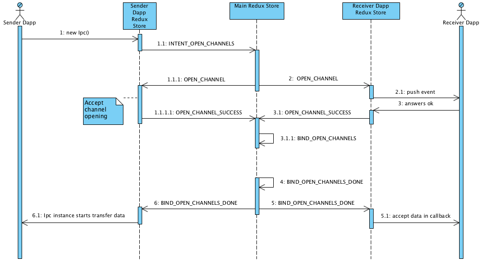
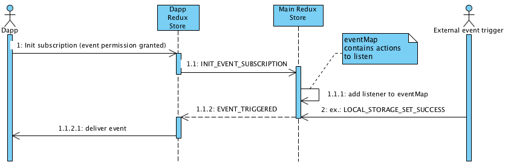

# Architecture technical documentation


Redux middleware for permission check diagram:


UUID target store resolver diagram:


Dapp communication protocol:


Resolve CHANNEL_ID before dapp communication starts:


Events API protocol:


#### Links
> https://www.i2b2.org/software/projects/datarepo/CRC_Architecture_10.pdf

# Array library documentation

```
array
|- dapp - |
|         |-- subscribe
|
|- ipcCommunicator
```

# array.dapp
The `array.dapp` object control your decentralized application event lifecycle.

Events
------
The `dapp` object emits the following events:

### Event: 'will-finish-launching'
Emitted when the application has finished basic startup.

### Event: 'active'
Emitted when the application has changed state to foreground. User works with your dapp.

### Event: 'non-active'
Emitted when the application has changed state to background. User currently works with another dapp.

### Event: 'quit'
Returns:

* `event` Event
* `exitCode` Integer

Emitted when the application is quitting.


# array.dapp.subscribe
The `array.dapp.subscribe` function lets you subscribe to specific events your dapp depends on.

```
array.dapp.subscribe(type [, options] [, callback]);
```
Parameters
----------

1. ``String`` - The subscription, you want to subscribe to.
2. ``Mixed`` - (optional) Optional additional parameters, depending on the subscription type.
3. ``Function`` - (optional) Optional callback, returns an error object as first parameter and the result as second. Will be called for each incoming subscription, and the subscription itself as 3 parameter.
 
Returns
-------

``EventEmitter`` - A Subscription instance

Example
-------

```javascript
    var subscription = array.dapp.subscribe('pendingTransactions', function(error, result) {
        if (!error) { console.log(result); }
    })
    .on("data", function(transaction) {
        console.log(transaction);
    });
    // unsubscribes the subscription
    subscription.unsubscribe(function(error, success) {
        if(success) { console.log('Successfully unsubscribed!'); }
    });
```

# array.ipcCommunicator
Communicate asynchronously from the your dapp process to another dapp.
The `ipcCommunicator` module is an instance of the `EventEmitter` class. It provides a few methods so you can:
* send synchronous and asynchronous messages from your dapp to another
* handle asynchronous and synchronous messages sent from other dapps. Messages sent from other dapp will be emitted to this module.
    
Parameters
----------

1. ``String`` - Dapp communication receiver name, you want talk to, `null` for handle messages.

Returns
-------

``EventEmitter`` - A Subscription instance

Example
-------

```javascript
  const { ipcCommunicator } = require('array');
  var senderDappComm = new ipcCommunicator('receiverDappName');
  
  senderDappComm.on('asynchronous-message', (event, arg) => {
    console.log(arg); // prints "ping"
    event.sender.send('asynchronous-reply', 'pong');
  })
  
  senderDappComm.on('synchronous-message', (event, arg) => {
    console.log(arg); // prints "ping"
    event.returnValue = 'pong';
  })
```

#### Links
> [Electron app](https://electronjs.org/docs/api/app)

> [Electron source code](https://github.com/electron/electron/search?q=continue-activity&unscoped_q=continue-activity)

> web3 events api:
>> https://web3js.readthedocs.io/en/1.0/callbacks-promises-events.html?highlight=eventEmitter
>> https://web3js.readthedocs.io/en/1.0/web3-eth-subscribe.html?highlight=eventEmitter
>> https://github.com/ethereum/web3.js/blob/develop/lib/web3.js
